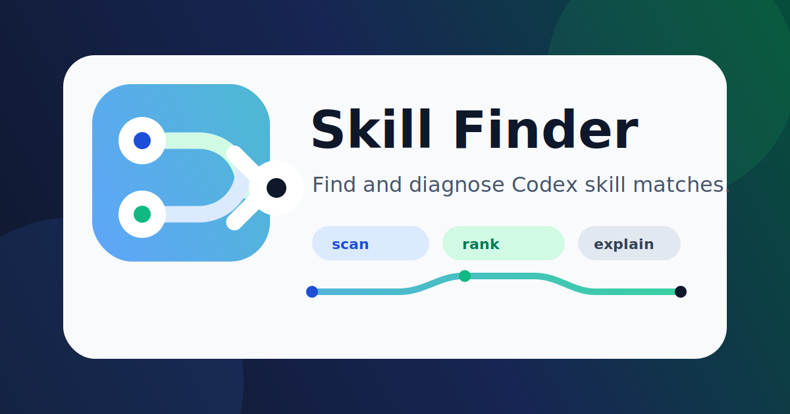

# Skill Finder

<p align="center">
  
</p>

<p align="center">
  <a href="skill-router/SKILL.md"></a>
  <a href="LICENSE"></a>
  
</p>

Skill Finder is a Codex skill for discovering, comparing, and diagnosing installed Codex skills. The package name remains `skill-router` for compatibility, but the goal is more precise: it helps explain which skill might fit, why a skill did not show up, and how skill metadata can be improved.

It is not a platform-level automatic dispatcher. A Codex skill cannot make itself run before it is invoked. Use this as a finder and routing doctor when you want evidence, not as a guarantee that the correct skill will always be selected.

## What It Does

- Scans installed `SKILL.md` files from common Codex skill roots.
- Parses each skill's `name` and `description` metadata.
- Supports single-line and folded/literal multiline YAML frontmatter descriptions.
- Ranks candidate skills with deterministic token matching.
- Deduplicates repeated plugin-cache copies.
- Reports query-token coverage so weak matches are easy to spot.
- Prints a short diagnosis with confidence, evidence, gaps, and a recommended next step.
- Helps identify metadata problems such as missing trigger words or unreadable descriptions.

## Good Uses

Use `$skill-router` when a prompt sounds like:

```text
Which installed skill might fit this task?
Why did academic-research-suite not show up?
Do I have a skill for ESP32 work?
Find skills related to GitHub Actions failures.
Suggest better description wording for this skill.
```

## Install

Clone this repository, then copy the `skill-router` folder into your Codex skills directory.

### macOS or Linux

```bash
git clone https://github.com/Joegao2004/skill-router.git
mkdir -p "${CODEX_HOME:-$HOME/.codex}/skills"
cp -R skill-router/skill-router "${CODEX_HOME:-$HOME/.codex}/skills/skill-router"
```

### Windows PowerShell

```powershell
git clone https://github.com/Joegao2004/skill-router.git
New-Item -ItemType Directory -Force -Path "$env:USERPROFILE\.codex\skills" | Out-Null
Copy-Item -Recurse -Force .\skill-router\skill-router "$env:USERPROFILE\.codex\skills\skill-router"
```

The install commands copy only the `skill-router/` folder, which is the actual Codex skill.

## Usage

In Codex:

```text
Use $skill-router to find and diagnose installed skills for this task: debug a failing GitHub Actions check.
```

Run the helper script directly:

```bash
python skill-router/scripts/rank_skills.py "build a frontend dashboard with React" --top 8
```

Emit JSON for automation:

```bash
python skill-router/scripts/rank_skills.py "summarize a Google Doc" --json
```

## Example Output

```text
1. gh-fix-ci  score=175.304
   path: .../github/skills/gh-fix-ci/SKILL.md
   why: name:fix, description:failing, description:github, description:action, description:check, description:pr
   coverage: 6/6 tokens
   description: Use when a user asks to debug or fix failing GitHub PR checks...

Diagnosis:
   best_candidate: gh-fix-ci
   confidence: strong
   why: `gh-fix-ci` has broad token coverage and a clear lead over other candidates.
   next_step: Read `.../gh-fix-ci/SKILL.md` before using the skill.
```

If coverage is low, the expected skill may not exist or may need better metadata. That is a useful result, not a failure.

## Repository Layout

```text
.
|-- README.md
|-- LICENSE
`-- skill-router/
    |-- SKILL.md
    |-- agents/
    |   `-- openai.yaml
    |-- assets/
    |   |-- icon-small.svg
    |   |-- icon-large.svg
    |   `-- social-preview.svg
    `-- scripts/
        `-- rank_skills.py
```

## Validate

If you have the Codex `skill-creator` validation script available:

```bash
python path/to/skill-creator/scripts/quick_validate.py skill-router
```

The installed skill stays compact for Codex context efficiency. This README carries the longer public explanation.
